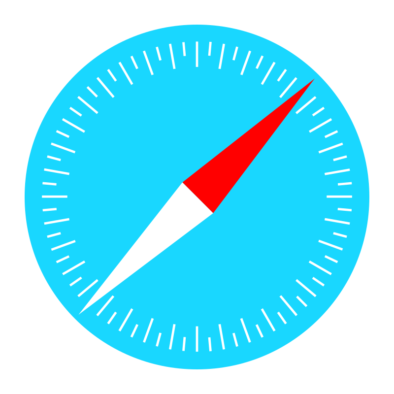

# Cartilla Interactiva para la Enseñanza de Música

<table border>
<tr>
<td>
Este proyecto está diseñado para ofrecer una amplia gama de recursos educativos musicales dirigidos a estudiantes de primaria y secundaria, de edades comprendidas entre los 6 y los 16 años. La cartilla interactiva incluye cinco módulos con información histórica y teórica, material gráfico, ejercicios interactivos, actividades en video, y juegos didácticos.
</td>
</tr>
</table>

---

## 📖 Documentación

- [📘 Sobre el proyecto](doc/about.md)
- [📕 Arquitectura](doc/architecture.md)
- [🖼️ Diagrama de flujo](doc/assets/system-flow.png)

---

## ☝️ Requisitos Previos

Antes de ejecutar este proyecto, asegúrate de tener instalado lo siguiente:

- **Node.js:** Descarga e instala Node.js desde [su sitio web oficial](https://nodejs.org/).
- **Git:** Si deseas clonar este repositorio, necesitarás tener Git instalado en tu sistema. Puedes descargarlo desde [su sitio web oficial](https://git-scm.com/).

## 🚀 Cómo ejecutar el proyecto

1. **Clonar el Repositorio**

   ```bash
   git clone https://github.com/tu-usuario/cartilla-interactiva.git
   ```

2. **Abrir la Terminal**

3. **Navegar al Directorio del Proyecto**

   ```bash
   cd cartilla-interactiva
   ```

4. **Instalación de Dependencias**

   ```bash
   npm install
   ```

5. **Iniciar el Servidor en Modo de Desarrollo**

   ```bash
   npm run dev
   ```

   Este comando utiliza `nodemon` para ejecutar el servidor, lo que permite que el servidor se reinicie automáticamente cada vez que se detectan cambios en los archivos del proyecto. Es útil durante el desarrollo para una experiencia de desarrollo más fluida.

6. **Iniciar el Servidor en Modo de Producción**

   ```bash
   npm start
   ```

   Este comando inicia el servidor en modo de producción utilizando el archivo de entrada principal especificado en `package.json`. No hay reinicio automático del servidor al utilizar este comando, por lo que es más adecuado para entornos de producción donde se requiere estabilidad y no se realizan cambios frecuentes en el código.

7. **Abrir el Navegador y Visitar**

   ```plaintext
   http://localhost:3000
   ```

---

## 🌐 Soporte del navegador

Aquí está la lista de todos los navegadores que admite esta aplicación.

<table align="center" border>
  <tr>
    <td align="center">
      
      <br />
      <strong>Chrome</strong>
    </td>
    <td align="center">
      
      <br />
      <strong>IE / Edge</strong>
    </td>
    <td align="center">
      
      <br />
      <strong>Firefox</strong>
    </td>
    <td align="center">
      
      <br />
      <strong>Safari</strong>
    </td>
    <td align="center">
      
      <br />
      <strong>Opera</strong>
    </td>
  </tr>
  <tr>
    <td align="center">
      
    </td>
    <td align="center">
      
    </td>
    <td align="center">
      
    </td>
    <td align="center">
      
    </td>
    <td align="center">
      
    </td>
  </tr>
</table>

---

<pre align="center">
  Copyright © 2024 SENA - SENNOVA
</pre>
