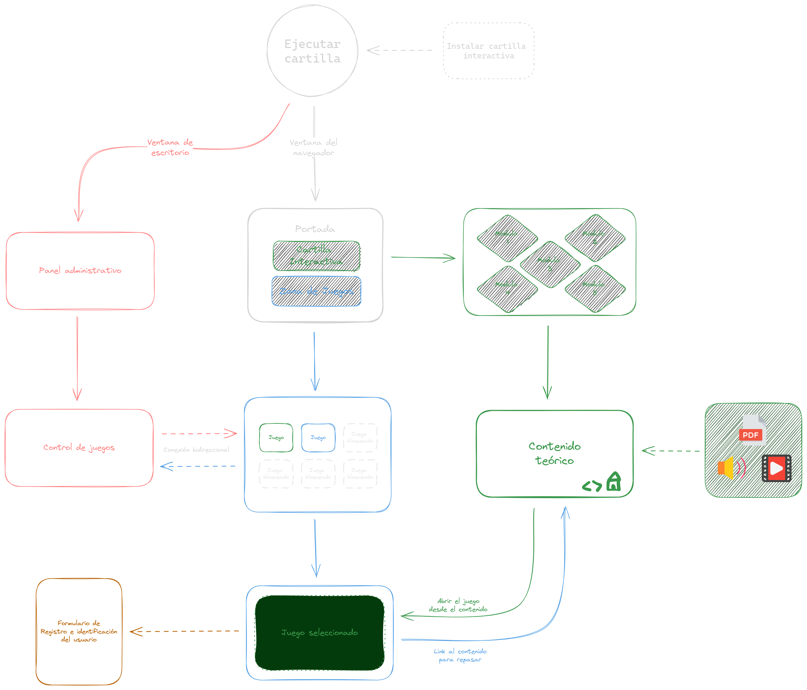
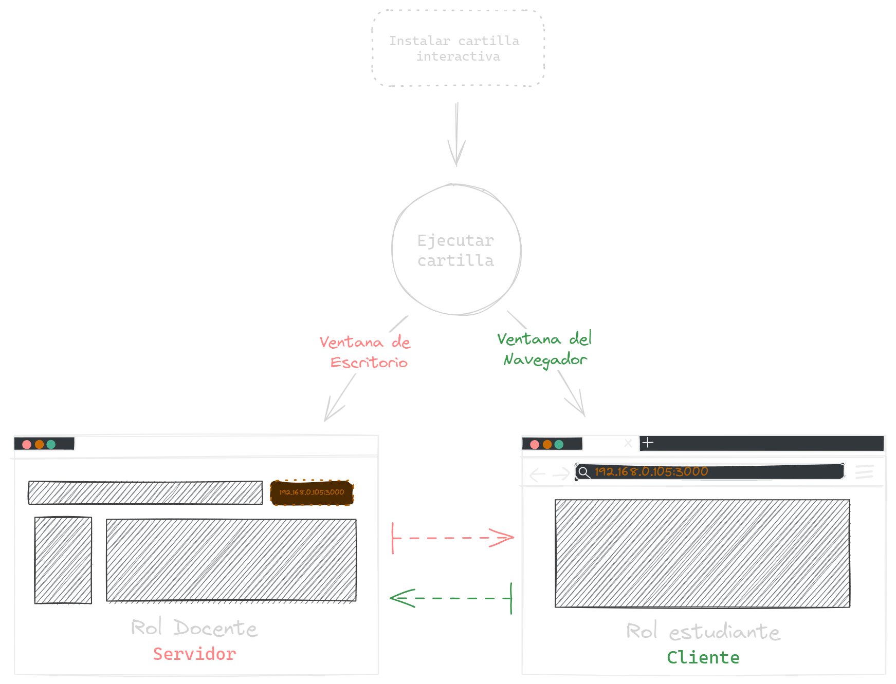

# Cartilla Interactiva para la Enseñanza de Música (RESÚMEN)

**Código del proyecto:** SGPS 12995

## Descripción del Proyecto

Este proyecto está diseñado para ofrecer una amplia gama de recursos educativos musicales dirigidos a estudiantes de primaria y secundaria, de edades comprendidas entre los 6 y los 16 años. La cartilla interactiva incluye cinco módulos con información histórica y teórica, material gráfico, ejercicios interactivos, actividades en video, y juegos didácticos.

---

## Estructura del Proyecto

### 1. Contenido Teórico de la Cartilla

Proporciona información detallada sobre la historia de la música y teoría musical, adaptada para diferentes niveles educativos.

### 2. Juegos Didácticos

- **Módulo 1:** Seis juegos interactivos para reforzar conceptos básicos.
- **Módulo 2:** Seis juegos adicionales que desarrollan habilidades musicales intermedias.
- **Módulo 4:** Dos juegos avanzados para una comprensión más profunda.
- **Módulo 5:** Un juego especializado para consolidar el aprendizaje.

### 3. Sistema General

Incluye:

- Panel administrativo
- Registro e identificación de usuarios
- Control y gestión de juegos

### 4. Empaquetamiento de la Cartilla

Desarrollo de un instalador compatible con Windows para facilitar la distribución y uso del programa.

### 5. Manual de Usuario

Un manual detallado disponible en formato PDF para guiar a los usuarios en el uso de la cartilla y sus componentes.

---

## Requisitos Claves

- **Funcionalidad Online/Offline:** La cartilla debe operar tanto con conexión a internet como sin ella.
- **Contenido Educativo:** Debe incluir información histórica y teórica sobre música.
- **Navegación Intuitiva:** Facilitar la navegación entre páginas.
- **Actividades Prácticas:** Ofrecer ejercicios y juegos digitales para reforzar el aprendizaje.
- **Acceso Docente:** Proporcionar una sección privada para la administración de contenidos y seguimiento del progreso por parte de los docentes.

---

## Flujo del Sistema y Roles

### Diagrama del Flujo del Sistema

### Diagrama de Distinción de Roles

---

## Tecnologías Utilizadas

| # | Tecnología | Descripción | Función |
|---|------------|-------------|---------|
| 1 | [HTML+CSS+JS](https://developer.mozilla.org/es/docs/Learn/HTML) | Stack web para el front-end | Presentación de interfaces gráficas y contenido |
| 2 | [Node.js](https://nodejs.org/) | Entorno de ejecución JavaScript para el back-end | Servidor local e interconexión |
| 3 | [Socket.io](https://socket.io/) | Librería para comunicación en tiempo real | Comunicación bidireccional entre servidor y cliente |
| 4 | [Electron](https://www.electronjs.org/) | Framework para aplicaciones de escritorio | Creación del instalador para Windows |

---

## Objetivo

La cartilla interactiva tiene como objetivo enriquecer el aprendizaje musical de los estudiantes mediante una plataforma educativa accesible y dinámica. A través de módulos teóricos y prácticos, los estudiantes pueden adquirir conocimientos musicales de manera efectiva y entretenida.

---

## Contacto

Para más información o consultas sobre el proyecto, por favor contactar a:

**Nombre:** Luis Arrieta  
**Correo electrónico:** <larrieta@sena.edu.co> - <luisarrieta796@gmail.com>  
**Teléfono:** 3245465727 - 3205067634
